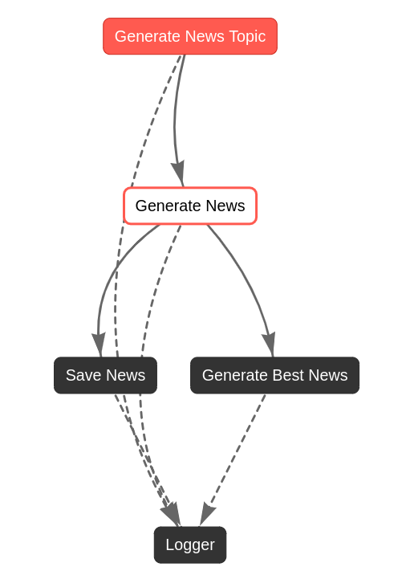

# Day05  - Daily News Curator Using CrewAI Flow

Welcome to the Day 05 Crew project, powered by [crewAI](https://crewai.com). 

This project automates the process of generating and curating daily news articles.Here's how it works:

1. **Trending AI Topic**: It starts identifying a trending topic within the field of Artificial Intelligence in the last 24 hours. For this task it was used Mistral model.
2. **News Generation**: Based on the identified topic, it generates a news article using a crew (a senior research agent and a report analyst agent).
3. **Best News Selection**: Employing the LLM again, the program analyzes the generated article and chooses the most important news snippet.
4. **News Saving**: Finally, the chosen news is saved as a markdown file (".md") within a dedicated news directory for future reference.

These steps are organized and executed using a new feature of CrewAI called Flow. It allows you to combine coding tasks and Crews, create event-driven workflows, or connect multiple tasks. The above steps can be seen in the flow diagram below:



## Installation

Ensure you have Python >=3.10 <=3.13 installed on your system. This project uses [UV](https://docs.astral.sh/uv/) for dependency management and package handling, offering a seamless setup and execution experience.

First, if you haven't already, install uv:

```bash
pip install uv
```

Next, navigate to your project directory and install the dependencies:

(Optional) Lock the dependencies and install them by using the CLI command:
```bash
crewai install
```
### Customizing

**Add your `OPENAI_API_KEY` into the `.env` file**

- Modify `src/day_05/config/agents.yaml` to define your agents
- Modify `src/day_05/config/tasks.yaml` to define your tasks
- Modify `src/day_05/crew.py` to add your own logic, tools and specific args
- Modify `src/day_05/main.py` to add custom inputs for your agents and tasks

## Running the Project

To kickstart your crew of AI agents and begin task execution, run this from the root folder of your project:

```bash
$ crewai run
```

This command initializes the day_05 Crew, assembling the agents and assigning them tasks as defined in your configuration.

This example, unmodified, will run the create a `report.md` file with the output of a research on LLMs in the root folder.

## Understanding Your Crew

The day_05 Crew is composed of multiple AI agents, each with unique roles, goals, and tools. These agents collaborate on a series of tasks, defined in `config/tasks.yaml`, leveraging their collective skills to achieve complex objectives. The `config/agents.yaml` file outlines the capabilities and configurations of each agent in your crew.

## Support

For support, questions, or feedback regarding the Day04 Crew or crewAI.
- Visit our [documentation](https://docs.crewai.com)
- Reach out to us through our [GitHub repository](https://github.com/joaomdmoura/crewai)
- [Join our Discord](https://discord.com/invite/X4JWnZnxPb)
- [Chat with our docs](https://chatg.pt/DWjSBZn)

Let's create wonders together with the power and simplicity of crewAI.
